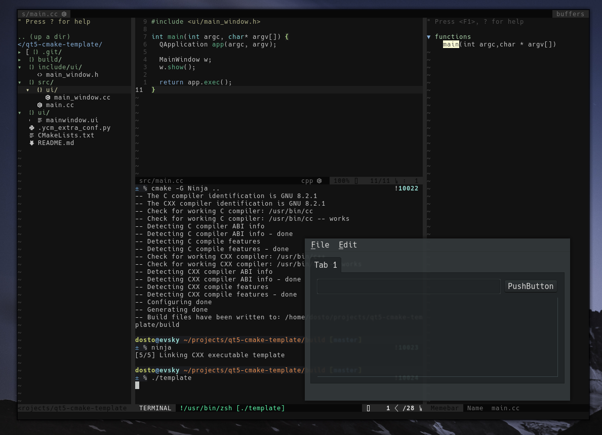

# Qt5 CMake Project Template

This repo acts to serve as a time-saver when I'm working on my own Qt projects.

There's a few things you might want to note:
* The (albeit little) code supplied uses Google's codestyle (i.e. 2 spaces, not tabs).
* There's no example of slots, actions, etc. usage (I'll add this at some point).
* I'll write a small YCM configuration soon enough.
